# Day- 2 Server Basics

The syllabus and the asserssment for the session is in this [docs](https://docs.google.com/document/d/1wxOXLIH7FEAjz_2nak69pwKgkVUd0fz5TpgzudXkkSE/edit?tab=t.0)

## Session Overview

In this session, we covered the fundamentals of Linux servers, SSH, server management, and deploying a simple Django application using Gunicorn. The primary focus was on understanding how Linux servers operate, the importance of SSH for secure connections, and practical knowledge of running and managing server processes. Additionally, we explored key Linux commands for file management, process handling, and debugging, along with configuring firewalls and understanding essential ports.

## Assessment Overview

The hands-on assessment involved setting up an SSH key pair, deploying a Django application using Gunicorn, managing processes via systemctl, and effectively handling .env files for environment-specific configurations. This session aimed to provide a foundational understanding of server management and deployment, to work efficiently with Linux-based systems.

## Assessment Directory Structure

I have created the assessment folder `Day2Servers` inside the root `Internship-Assessment-2025` Folder. The django project is created inside the `Day2Servers` folder. The Django root project directory is `Assessment1`.

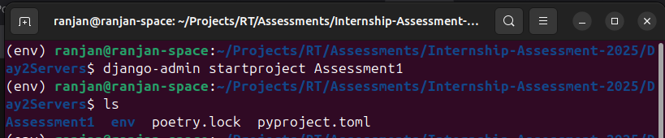

TO show the django project structure I also have created a app `Users`

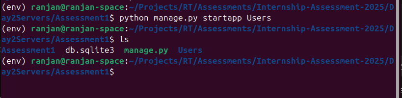

The `Day2Servers` Directory looks like this:

```
Day2Servers
│   .env
|   poetry.lock
|   pyproject.toml
│   README.md (This file)
│
└───env
|   │   ...
|
└───Screenshots
|   │   ...
|
└───Assessment1
    │   db.sqlite3
    │   manage.py
    |
    └───Assessment1
    |   |
    |   └───__pycache__
    |   |   |   ....
    |   |
    |   │   asgi.py
    |   │   seetings.py
    |   │   urls.py
    |   │   wsgi.py
    |
    └───Users
        │
        └───migrations
        |   |
        |   └───migration files
        |
        │   __init__.py
        │   admin.py
        │   apps.py
        │   models.py
        │   tests.py
        |   views.py
```

## Assessment 1- Using ssh keygen to get access to github repo

### Creating ssh public key from terminal

Use command `ssh key-gen -i 2046` to create a public private token pair.
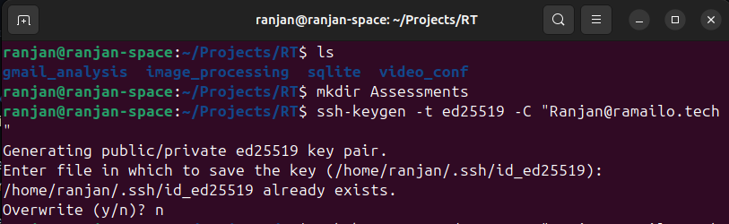

Then a prompt will ask you the directory, you can simply state "y" for the default path or change the path as needed.
For Now I will save the key as in `id_git`.

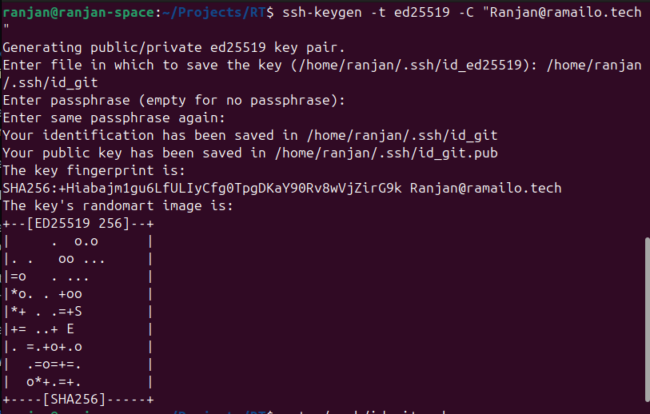

Then navigate to the file `id_git.pub` and copy the public key which we will need in our github ssh keygen process

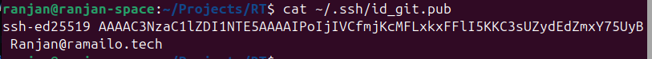

Notice The private token is stored at id_git. DO NOT Share this key

### Creating SSH Keygen for github

The Github keygen was created following [this](https://docs.github.com/en/enterprise-cloud@latest/authentication/connecting-to-github-with-ssh/adding-a-new-ssh-key-to-your-github-account) documentation.

#### step 1:

    Signin to your github profile

#### step 2:

    In the upper-right corner of any page on GitHub, click your profile photo, then click  Settings.

#### step 3:

    In the "Access" section of the sidebar, click  SSH and GPG keys.

#### step 4:

    Click New SSH key or Add SSH key.

#### step 5:

    In the "Title" field, add a descriptive label for the new key. For example, if you're using a personal laptop, you might call this key "Personal laptop".

#### step 6:

    Select the type of key: authentication

#### step 7:

    Add the public key you generated above (in .ssh/id_git.pub)

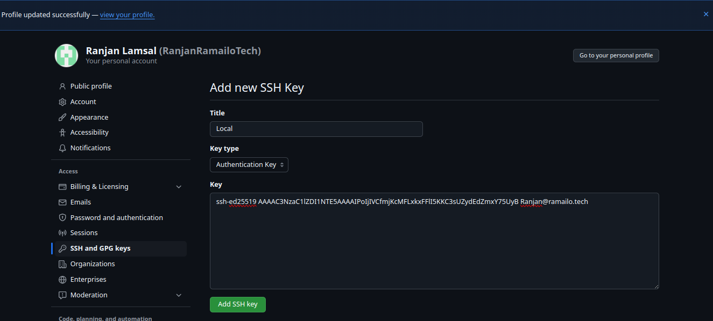

Now the ssh has been setup. You can see the completion of keygen creation as:

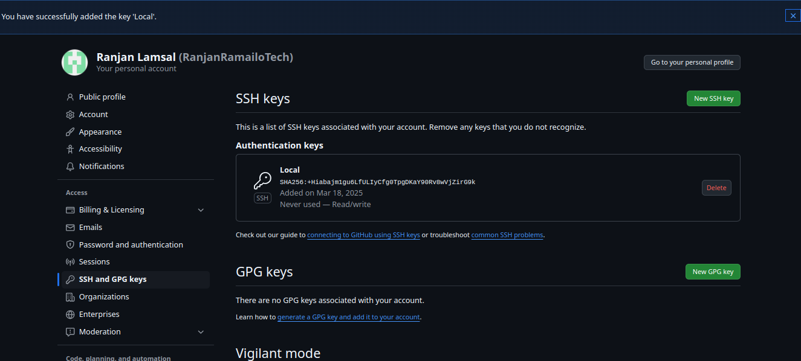

## Assessment 2- Creating a dummy django project setup and starting server with gunicorn

### Project Setup

1. **Clone the repo:** Use ssh to clone the repo

   ```bash
   git clone git@github.com:RanjanRamailoTech/Internship-Assessment-2025.git
   ```

   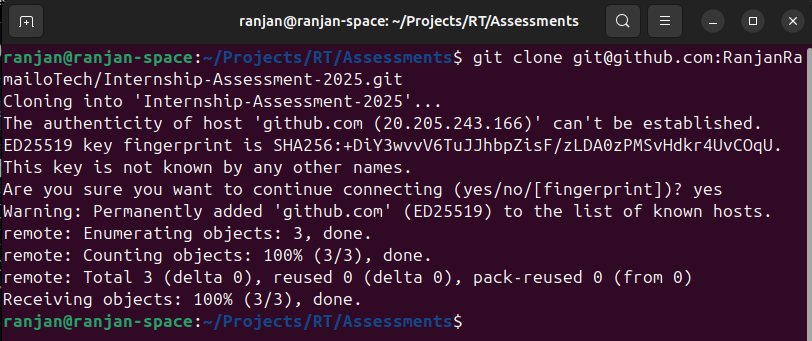

2. **Set Up Virtual Environment:** Notice the root directory contains the assessment folder.
   use `cd Day2Servers` to enter the assessment folder. Then activate the virtual environment as:

   ```bash
   python -m venv venv
   source venv/bin/activate  # Linux/Mac
   venv\Scripts\activate     # Windows
   ```

3. **Install Poetry:**

   ```bash
   pip install poetry
   ```

4. **Install dependencies:**

   ```bash
   poetry install
   ```

5. **Configure Environment Variables:**
   Create a `.env` file in the project root. Use `touch .env` to create a `.env` file and then `nano .env` to enter write the content. Write following content as they are required to setup the postgres database.

   ```
   DB_NAME=Your_DB_Name
   DB_USER=Your_DB_User
   DB_PASSWORD=Your_DB_Password
   DB_HOST=Your_DB_Host
   DB_PORT=Your_DB_Port
   ```

   Notice that `Day2Server` is the root directory of our assessment. However it is not the root directory of the Django project. Now since .env is not in the root directory, let's move the file in our root project directory.

   ```bash
    mv .env Assessment1/
   ```

   Notice the .env file is moved in the project root directory i.e in `Assessment1/`.

   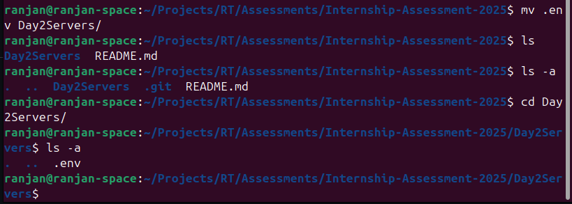

6. **Initialize the database:**

   ```bash
   poetry run python manage.py makemigrations
   poetry run python manage.py migrate
   ```

7. **Start the Development Server:**

   ```bash
   poetry run python manage.py runserver
   ```

   The backend server will be running at `127.0.0.1:8000`.

### Start server using Gunicorn

1. **Install Gunicorn:**

   ```bash
   poetry add gunicorn
   ```

   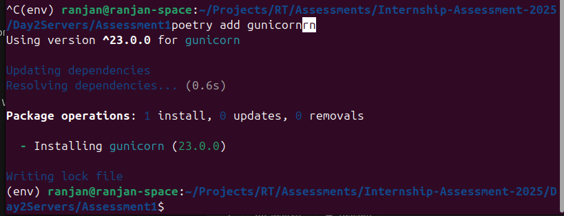

2. **Run the server:**

   ```bash
   poetry run gunicorn your_project_name.wsgi:application --bind 0.0.0.0:8000
   ```

   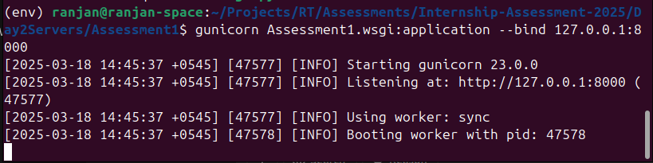

### Check the process running in port 8000

```bash
lsof -i:8000
```

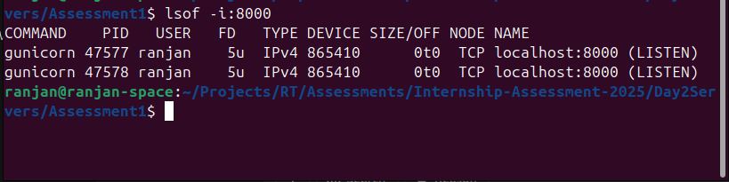

## Assessment 3- Manage Gunicorn Process using `systemctl`

1. **Systemd service:** Create a Gunicorn service file:

   ```bash
   sudo touch /etc/systemd/system/gunicorn.service
   ```

2. **Add the following configuration:**
   `sudo nano /etc/systemd/system/gunicorn.service`
   Then add the following configuration to the `gunicorn.service` file you just created.

   ```bash
    [Unit]
    Description=Gunicorn daemon for Django project
    After=network.target

    [Service]
    User=ranjan
    Group=www-data
    WorkingDirectory=/home/ranjan/Projects/RT/Assessments/Internship-Assessment-2025/Day2Servers/Assessment1
    ExecStart=/home/ranjan/Projects/RT/Assessments/Internship-Assessment-2025/Day2Servers/env/bin/gunicorn Asses>

    [Install]
    WantedBy=multi-user.target
   ```

   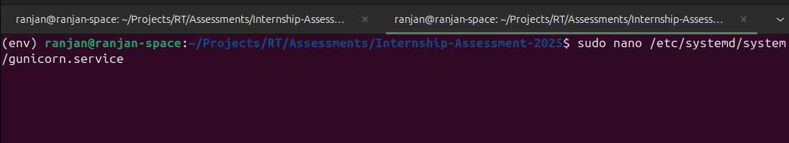
   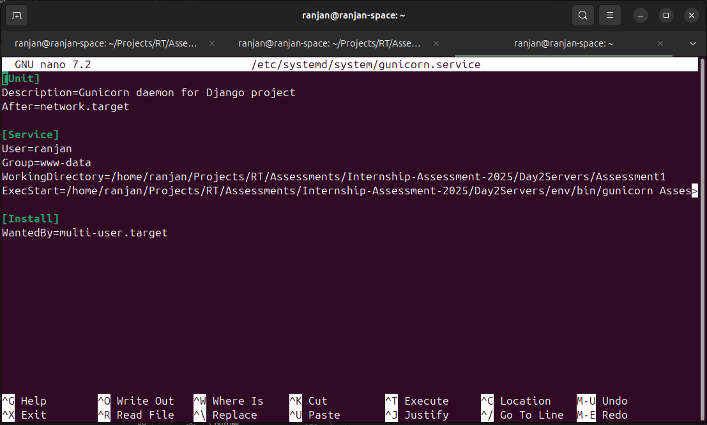

   add the content provided above and then `ctrl + X` to save the changes and exit.

3. **start service:** Use following command to start and enable the service `gunicorn.service`. Note that `start` and `enable` are different terms. `start` command starts a specified service and the service is `active` while `enable` command starts the service even after reboot. `enable` command is used whenever you want your specified service to startup after reboot.

   ```bash
   sudo systemctl start gunicorn
   sudo systemctl enable gunicorn # To start Gunicorn on boot
   ```

4. **Check status of the service:** Use following command to check status of the service `gunicorn.service`.

   ```bash
   sudo systemctl status gunicorn
   ```

   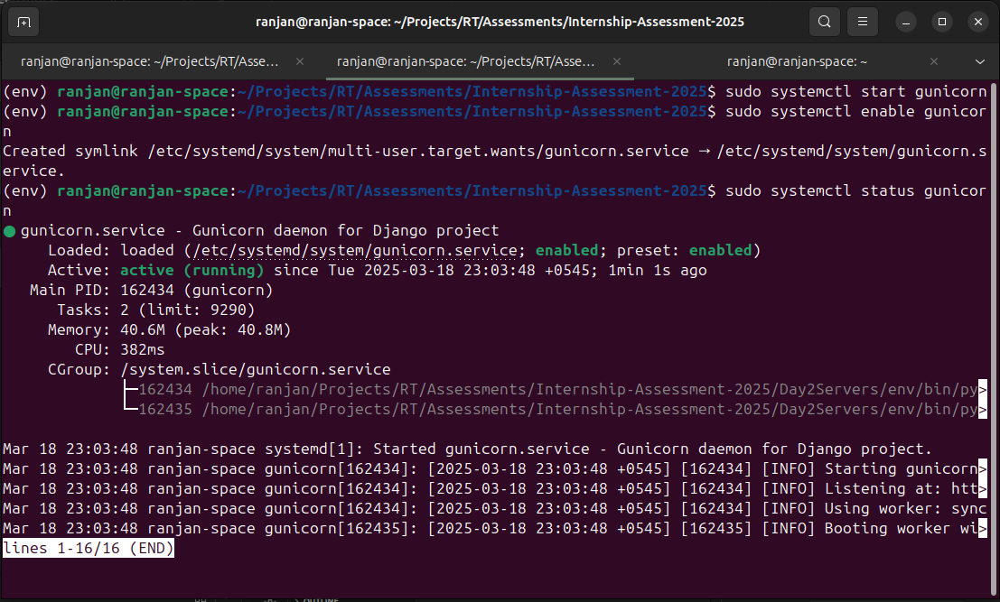

   Notice that the service is both active and enabled.

5. **Stop the service:** Use following command to stop the service `gunicorn.service`.

   ```bash
   sudo systemctl stop gunicorn
   ```

   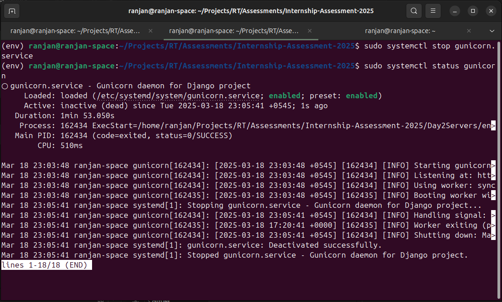

   Notice the procerr is enabled but is not yet active. We have to manually activate the process by `start` command.

   When the gunicorm service is started, the process is created that listens on port `8000` the same as doing `python manage.py runserver`.
   CHeck the django server running on `localhost:8000` from your browser.

   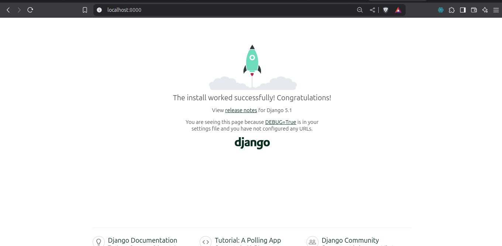
