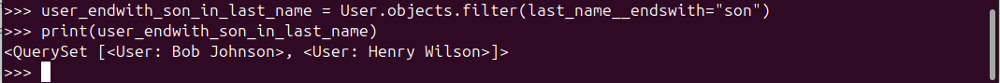
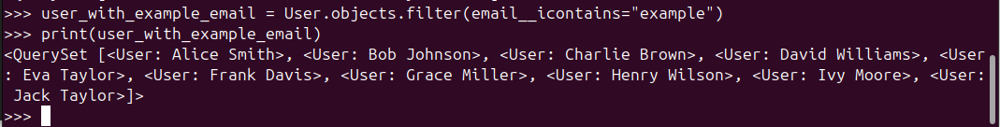

# Day- 2 Django Basics

The syllabus and the asserssment for the session is in this [docs](https://docs.google.com/document/d/1hAE8tr56tLtnMrA4ttCCNuSPG5nQQA_6Gr0vt2Fk_6w/edit?tab=t.0)

---

## Session Overview

- Django project and app setup
- Model, serializer, and viewset for a basic user API
- CRUD operations with Django REST Framework
- Common edge cases and troubleshooting

---

## Assessment Overview

The assessment focuses on deepening our understanding of Django ORM through various practical tasks in the Django ORM Shell. The tasks include:

1. **Creation:** Learn how to use bulk_create(), get_or_create(), and update_or_create() to manage user data.
2. **Basic Retrieval:** Retrieve users with different conditions using methods like get(), filter(), and exists().
3. **Filtering & Lookups:** Use Django's filtering capabilities with conditions like startswith, icontains, and exclude().
4. **Ordering & Aggregation:** Learn how to sort, slice, and aggregate data, as well as annotate each user with computed fields.
5. **Updates & Deletions:** Update records using update() and bulk_update(), and delete records efficiently.
6. **Transactions & Error Handling:** Practice handling errors within database transactions.
7. **Query Inspection:** Understand how to inspect and optimize queries for performance.

---

## Assessment Directory Structure

I have created the assessment folder `Day3-Django` inside the root `Internship-Assessment-2025` Folder. The django project is created inside the `Day3-Django` folder. The Django root project directory is `Project`.

The `Day3-Django` Directory looks like this:

```
Day2Servers
│   .env
|   poetry.lock
|   pyproject.toml
│   README.md (This file)
|   db.sqlite3
│   manage.py
|   .gitignore
│
└───env
|   │   ...
|
└───Screenshots
|   │   ...
|
|
└───Project
|   |
|   └───__pycache__
|   |   |   ....
|   |
|   |   __init__.py
|   │   asgi.py
|   │   seetings.py
|   │   urls.py
|   │   wsgi.py
|
└───User
    |
    └───__pycache__
    |   |   ....
    │
    └───migrations
    |   |
    |   └───migration files
    |
    │   __init__.py
    │   admin.py
    │   apps.py
    │   models.py
    │   tests.py
    |   views.py
    |   serializers.py
    |   urls.py
    |   user_service.py
```

---

## Project Setup

1. **Clone the repo:** Use ssh to clone the repo

   ```bash
   git clone git@github.com:RanjanRamailoTech/Internship-Assessment-2025.git
   ```

2. **Set Up Virtual Environment:** Notice the root directory contains the assessment folder.
   use `cd Day3-Django` to enter the assessment folder. Then activate the virtual environment as:

   ```bash
   python -m venv venv
   source venv/bin/activate  # Linux/Mac
   venv\Scripts\activate     # Windows
   ```

3. **Install Poetry:**

   ```bash
   pip install poetry
   ```

4. **Install dependencies:**

   ```bash
   poetry install
   ```

5. **Configure Environment Variables:**
   Create a `.env` file in the project root. Use `touch .env` to create a `.env` file and then `nano .env` to enter write the content. Write following content as they are required to setup the postgres database.

   ```
   DB_NAME=Your_DB_Name
   DB_USER=Your_DB_User
   DB_PASSWORD=Your_DB_Password
   DB_HOST=Your_DB_Host
   DB_PORT=Your_DB_Port
   ...(any other env variables)
   ```

6. **Initialize the database:**

   ```bash
   poetry run python manage.py makemigrations
   poetry run python manage.py migrate
   ```

7. **Start the Development Server:**

   ```bash
   poetry run python manage.py runserver
   ```

   The backend server will be running at `127.0.0.1:8000`.

---

## Assessments

**Initial bash code**: The initial bash code as:


### 1️⃣ Creation

1. **Create 10 Users via bulk_create.**
   For Bulk user creation I used gpt to create dummy data.

```bash
users = [
    User(first_name="Alice", last_name="Smith", email="alice.smith@example.com"),
    User(first_name="Bob", last_name="Johnson", email="bob.johnson@example.com"),
    User(first_name="Charlie", last_name="Brown", email="charlie.brown@example.com"),
    User(first_name="David", last_name="Williams", email="david.williams@example.com"),
    User(first_name="Eva", last_name="Taylor", email="eva.taylor@example.com"),
    User(first_name="Frank", last_name="Davis", email="frank.davis@example.com"),
    User(first_name="Grace", last_name="Miller", email="grace.miller@example.com"),
    User(first_name="Henry", last_name="Wilson", email="henry.wilson@example.com"),
    User(first_name="Ivy", last_name="Moore", email="ivy.moore@example.com"),
    User(first_name="Jack", last_name="Taylor", email="jack.taylor@example.com")
]

User.objects.bulk_create(users)

```


2. **Create user with create**

```bash
user = User.objects.create(first_name="Ranjan", last_name="Lamsal", email="Ranjan@ramailo.tech")
```


3. **Use get_or_create() for a user with email "unique@test.com".**

```bash
user = User.objects.get_or_create(email="unique@test.com", defaults={"first_name": "Unique", "last_name": "User"})

```


4. **Use update_or_create() to change first_name for "unique@test.com"**

```bash
user = User.objects.update_or_create(email="unique@test.com", defaults={"first_name": "UpdatedUnique", "last_name": "User"})
```


### 2️⃣ Basic Retrieval

5. **Retrieve all users**

```bash
User.objects.all()
```


6. **Get the first and last user**

```bash
User.objects.all()[0] #First user
l = len(User.objects.all()) #number of users to determine last index
User.objects.all()[l-1] #Last user
```


7. **Fetch user by primary key with error handling (catch DoesNotExist)**

```bash
from django.core.exceptions import ObjectDoesNotExist
try:
   user = User.objects.get(pk=1)
   print(user)
except ObjectDoesNotExist:
   print("User with the specified primary key does not exist.")

# Output: Alice Smith
try:
   user = User.objects.get(pk=7)
   print(user)
except ObjectDoesNotExist:
  print("User with the specified primary key does not exist.")

# Output: Grace Miller
try:
   user = User.objects.get(pk=20)
   print(user)
except ObjectDoesNotExist:
   print("User with the specified primary key does not exist.")

# Output: User with the specified primary key does not exist.
```


8. **Check if any user exists with email containing "gmail.com"**

```bash
gmail_exists = User.objects.filter(email__icontains="gmail.com").exists()
print(gmail_exists)
```


### 3️⃣ Filtering & Lookups

9. **Filter users whose first_name starts with "A".**

```bash
user_with_A = User.objects.filter(first_name__startswith="A")
print(user_with_A)
```


10. **Filter users whose last_name ends with "son".**

```bash
user_endwith_son_in_last_name = User.objects.filter(last_name__endswith="son")
print(user_endwith_son_in_last_name)
```



11. **Filter users with email contains "example".**

```bash
user_with_example_email = User.objects.filter(email__icontains="example")
print(user_with_example_email)
```



12. **Exclude users whose email ends with "@test.com".**

```bash
user_without_test_email = User.objects.exclude(email__endswith="@test.com")
print(user_without_test_email)
```


13. **Filter by a list of last_names (\_\_in).**

```bash
last_names = ['Smith', 'Johnson', 'Brown']
users = User.objects.filter(last_name__in=last_names)
print(list(users))
```


14. **Combine OR conditions using Q (first_name startswith “J” OR last_name contains “Smith”).**

```bash
user_with_A_or_smith = User.objects.filter(Q(first_name__startswith="J") | Q(last_name__icontains="Smith"))
print(user_with_A_or_smith)
```


### 4️⃣ Ordering, Slicing & Counts

15. **Order by last_name ascending, then first_name descending.**

```bash
user_orderby_l_name_asc = User.objects.all().order_by('last_name') #ascending order by last name
print(user_orderby_l_name_asc)

user_orderby_f_name_desc = User.objects.all().order_by('-first_name') #descending order by first name
print(user_orderby_f_name_desc)
```


16. **Slice to retrieve users 3–6.**

```bash
users_sliced = User.objects.all()[2:6]
print(users_sliced)
```


17. **Count total users; count distinct last names.**

```bash
num_total_users = len(User.objects.all())
print(f"Total number of users is : {num_total_users}")

num_distinct_last_names = User.objects.values('last_name').distinct().count()
print(f"There are {num_distinct_last_names} distinct last names of users so far.")
```


18. **Use .exists() to verify if any user remains after deleting a subset.**

```bash
#First lets delete subset of users with "Test" in first name
User.objects.filter(first_name="Test").delete()
users_remain = User.objects.exists()
print(users_remain)
```


### 5️⃣ Aggregation & Annotation

19. **Aggregate → total count, max and min id.**

```bash
from django.db.models import Count, Max, Min

aggregation = User.objects.aggregate(
    total_count=Count('id'),
    max_id=Max('id'),
    min_id=Min('id')
)
print(aggregation)

```


20. **Annotate each user with a computed full_name (Concat).**

```bash
from django.db.models import F, Value
from django.db.models.functions import Concat

users_with_full_name = User.objects.annotate(
    full_name=Concat(F('first_name'), Value(' '), F('last_name'))
)

for user in users_with_full_name:
    print(user.full_name)
```


21. **Annotate each user with length of email (Length).**

```bash
from django.db.models.functions import Length

users_with_email_length = User.objects.annotate(
    email_length=Length('email')
)
for user in users_with_email_length:
    print(f'email: {user.email}, email_length: {user.email_length}')
```


22. **Group by last_name and return last_name + count of users sharing it.**

```bash
users_grouped_by_last_name = User.objects.values('last_name').annotate(
    user_count=Count('id')
).order_by('last_name')

for group in users_grouped_by_last_name:
    print(group)
```


### 6️⃣ Updates

23. **Update all users’ last_name to uppercase using update() + Upper(F('last_name'))**

```bash
User.objects.update(last_name=Upper(F('last_name')))
#Output is integer (The update() method returns the count of rows modified.)
```


24. **Bulk‑update a slice of users to change email domain (use bulk_update)**

```bash
users_to_update = User.objects.filter(id__in=range(3, 7)) #slice of users

for user in users_to_update:
    user.email = user.email.replace('@example.com', '@example_updated.com')

User.objects.bulk_update(users_to_update, ['email'])

emails = User.objects.values_list('email', flat=True)
print(list(emails))
```


25. **Use update_or_create() again to add a missing field value**

```bash
user, created = User.objects.update_or_create(
    first_name='Bob',
    defaults={'last_name': 'WILSON', 'email': 'sam.wilson@example.com'}
)
```


Here we first find the user with name Bob and then changed the last_name and email as the user exists.

### 7️⃣ Deletion

26. **Delete users whose first_name contains "test"**

```bash
user_to_delete = User.objects.filter(first_name__icontains="test")
user_to_delete.delete()
```


Here we first created a user with first name "test" and then delete the user having first_name "test"

27. **Delete all remaining users in one QuerySet call**

```bash
User.objects.all().delete()
```


### 8️⃣ Query Inspection

28. **execute query to select users with first_name starting with "A"**

```bash
users = User.objects.filter(first_name__startswith='A')
```


### 9️⃣ Transactions & Error Handling

29. **Within transaction.atomic(), attempt to create two users — force a duplicate‑email IntegrityError and show rollback**

```bash
try:
    with transaction.atomic():
        user1 = User.objects.create(first_name="John", last_name="Doe", email="duplicate@example.com")
        print("User 1 created:", user1)

        user2 = User.objects.create(first_name="Jane", last_name="Doe", email="duplicate@example.com")
        print("User 2 created:", user2)

except IntegrityError as e:
    print("IntegrityError occurred. Transaction is rolled back:", str(e))
```


30. **Catch and print the IntegrityError when manually creating a duplicate**

```bash
try:
   user1 = User.objects.create(first_name="Alice", last_name="Smith", email="duplicate@example.com")
   print("User 1 created:", user1)

   user2 = User.objects.create(first_name="Bob", last_name="Johnson", email="duplicate@example.com")
   print("User 2 created:", user2)

except IntegrityError as e:
   print("IntegrityError occurred:", str(e))
```


### 🔟 Performance & Meta

31. **Fetch only first_name + last_name using .only()**

```bash
users = User.objects.only('first_name', 'last_name')
```


