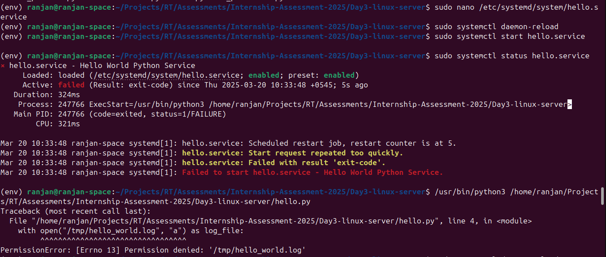
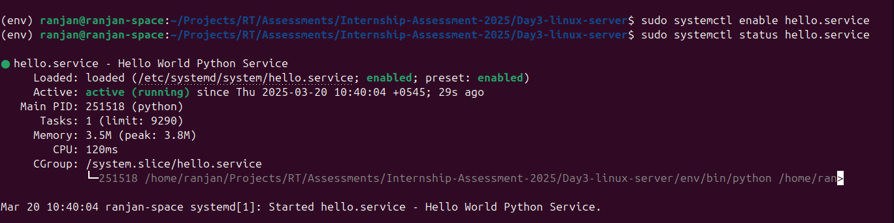
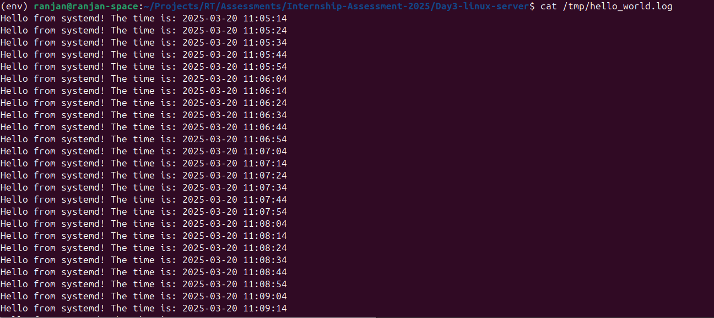
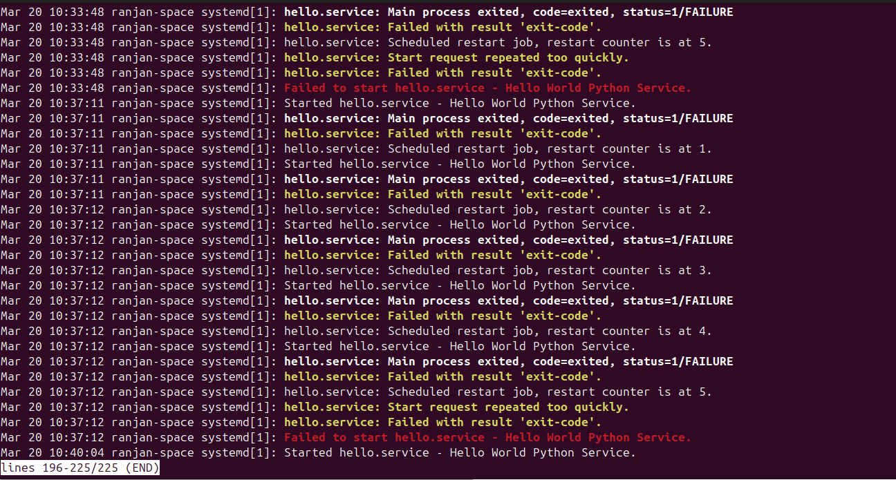
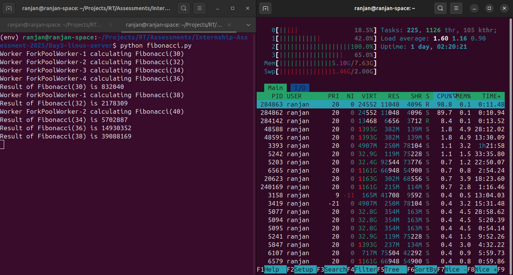
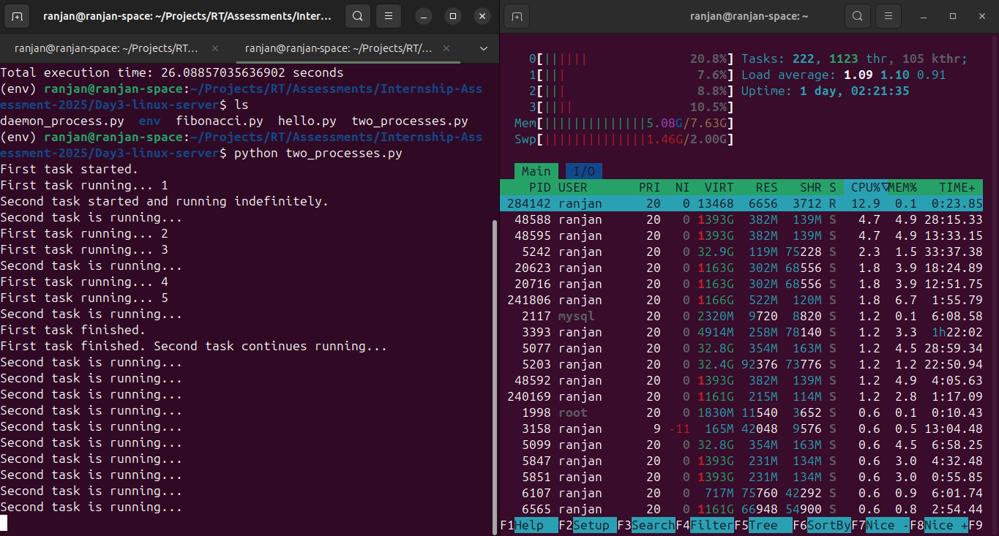
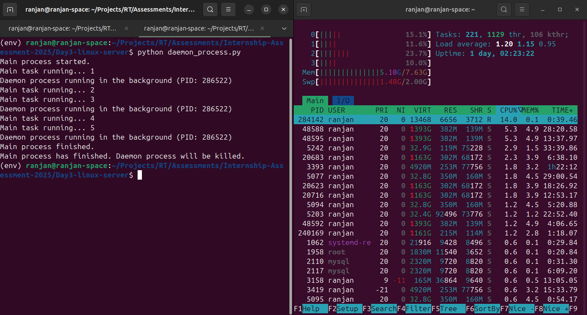

# Linux Server

In this session, we learned about setting up and managing Linux servers, creating and managing users, and handling permissions. We also explored the usage of systemd for running services in the background and configuring service files. Additionally, we learned how to utilize multiprocessing in Python for handling multiple tasks simultaneously.

## Basic Linux Commands

### User Management:

**Adding new user:** `sudo adduser newuser`

**Setting password:** `sudo passwd newuser`

**Adding user to sudo group:** s`udo usermod -aG sudo newuser`

**Switching to a user:** `su username`

### SSH Configuration:

**Creating .ssh directory:** `mkdir .ssh`

**Setting permissions:** `chmod 700 .ssh`

**Creating authorized_keys file**: `touch .ssh/authorized_keys`

**Setting permissions:** `chmod 600 .ssh/authorized_keys`

### User Groups:

**Adding user to groups:** `sudo usermod -a -G groupname username`

**Changing file ownership:** `sudo chown -R :groupname /path/to/folder`

**Modifying folder permissions:** `sudo chmod -R 770 /path/to/folder`

### Service Management:

**Checking status:** `sudo systemctl status hello.service`

**Starting service:** `sudo systemctl start hello.service`

**Stopping service:** `sudo systemctl stop hello.service`

**Checking logs:** `sudo journalctl -u hello.service`

## Assessments

### 1. hello.py

#### Description

The hello.py script is a simple Python script that writes a timestamped message to a log file located at /tmp/hello_world.log every 10 seconds. It is designed to run as a background service managed by systemd.

#### Script (`hello.py`)

#### Service File (`/etc/systemd/system/hello.service`)

```bash
[Unit]
Description=Hello World Python Service
After=network.target

[Service]
ExecStart=/home/ranjan/Projects/RT/Assessments/Internship-Assessm>
Restart=always
User=ranjan
Group=ranjan
WorkingDirectory=/home/ranjan/Projects/RT/Assessments/Internship->
StandardOutput=append:/tmp/hello_world.log
StandardError=append:/tmp/hello_world.log

[Install]
WantedBy=multi-user.target
```

#### Managing the Service

1. **Start:** `sudo systemctl start hello.service`

2. **Restart:** `sudo systemctl restart hello.service`

3. **Status:**`sudo systemctl status hello.service`



**Here the service failed to start due to permission error. Let's give the permission to the file "hello_world.log" to all users by `chmod 666 /tmp/hello_world.log`**


4. **Enable (Start at boot):** s`sudo systemctl enable hello.service`

5. **Disable (Stop from starting at boot):** `sudo systemctl disable hello.service`



**let's check the log file `cat tmp/hello_world.log`**



6. **Checking system logs:** `sudo journalctl -u hello.service`



### NOTE: use `htop` command to view the processes and CPU core usage.

### 2. fibonacci.py

The fibonacci.py script demonstrates the use of the multiprocessing module to calculate Fibonacci numbers in parallel. It utilizes multiple processes to speed up the computation of CPU-bound tasks.



### 3. two_processes.py

The two_processes.py script runs two processes simultaneously: one that completes a task and exits, and another that continues running indefinitely. This demonstrates how to manage independent processes with the multiprocessing module.



### 4. daemon_process.py

The daemon_process.py script creates a daemon process that runs indefinitely in the background while a main task executes. The daemon process is terminated automatically when the main task finishes, illustrating how daemon processes can be used for background tasks.


