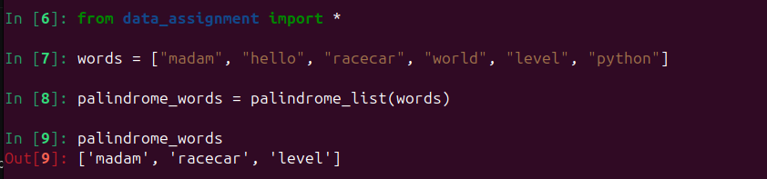

# Data Assignments
- **Input Files: ./Input_files**
- **Output Files: ./outputs**
- **Code FIles: "data_assignment.py", "file_assignment.py"**
## Problem: Create a List of Palindromes
You are given a list of strings. Use list comprehension to create a new list that contains only the words that are palindromes (i.e., words that read the same backwards as forward).

**words = ["madam", "hello", "racecar", "world", "level", "python"]**
#### Expected Output:
['madam', 'racecar', 'level']

### Solution
```
def palindrome_list(words):
    return [word for word in words if word == word[::-1]]
```

**OUTPUT**


## Problem: Grouping by First Letter
You are given a list of strings. Use dictionary comprehension to group the strings by their first letter.
words = ["apple", **"banana", "avocado", "blueberry", "cherry", "date"]**

#### Expected Output:
{'a': ['apple', 'avocado'], 'b': ['banana', 'blueberry'], 'c': ['cherry'], 'd': ['date']}

### Solution
```
def group_by_first_letter(words):
    return {word[0]: [w for w in words if w[0] == word[0]] for word in words}
```

**OUTPUT**


# File Handling Assignment

## 1. Find & Replace
Write replace_in_file(filename, old, new) that reads a text file, replaces all occurrences of old with new, and writes back.

### Input file: ip1.txt
```
Hello there this is the old file with all the old names and old structures.
By old I mean of old version. 
Hope you enjoy reading our old file.
```
### Output : 
```
In [1]: from file_assignment import *

In [2]: replace_in_file()
2025-04-29 10:56:22,585 - INFO - Replaced 'old' with 'new' in ./Input_files/ip1.txt and saved to ./outputs/op1.txt
```
#### op1.txt
```
Hello there this is the new file with all the new names and new structures.
By new I mean of new version. 
Hope you enjoy reading our new file.
```

## 2. Word Frequency Counter
Read a text file, count how often each word appears (ignore punctuation, case-fold words), and print the top 10 most frequent.

### Input file: ip2.txt
```
The quick brown fox jumps over the lazy dog. The dog barked at the fox, 
but the fox just kept running. Foxes are known for their quick movements 
and cunning behavior. The dog, on the other hand, remained lazy as ever.
```
### Output
```
In [3]: word_frequency_counter()
the: 7
fox: 3
dog: 3
quick: 2
lazy: 2
brown: 1
jumps: 1
over: 1
barked: 1
at: 1
```
## 3. Merge Two Files Line-by-Line
Given file1.txt and file2.txt, produce merged.txt where each line is line_from_file1 + " " + line_from_file2. Handle differing lengths gracefully.

### Input file: 
#### ip3a.txt
```
The sun was shining brightly.
She opened the ancient book carefully.
Children laughed in the playground.
Autumn leaves crunched underfoot.
He whispered the secret password.
```
#### ip3b.txt
```
Birds sang in the trees.
The pages smelled of dust.
Their joy echoed across the park.
The sound was strangely satisfying.
The door creaked open slowly.
A cat watched from the windowsill.
Rain began to fall softly.
```
### Output
```
In [4]: merge_files()
2025-04-29 10:56:41,013 - INFO - Merged ./Input_files/ip3a.txt and ./Input_files/ip3b.txt into ./outputs/op3.txt
```
#### op3.txt
```
The sun was shining brightly. Birds sang in the trees.
She opened the ancient book carefully. The pages smelled of dust.
Children laughed in the playground. Their joy echoed across the park.
Autumn leaves crunched underfoot. The sound was strangely satisfying.
He whispered the secret password. The door creaked open slowly.
A cat watched from the windowsill.
Rain began to fall softly.
```

## 4. Partial File Reader
```
Implement read_chunk(filename, start_byte, length) using seek and read that returns exactly length bytes starting from start_byte.
```
### Output:
```
In [5]: read_chunk()
2025-04-29 10:56:55,799 - INFO - Read 10 bytes from ./Input_files/ip3a.txt starting at byte 0
Out[5]: b'The sun wa'

In [6]: read_chunk(10,100)
2025-04-29 10:57:03,375 - ERROR - Error reading file: [Errno 9] Bad file descriptor

In [7]: read_chunk(start_byte=10,length=100)
2025-04-29 10:57:25,677 - INFO - Read 100 bytes from ./Input_files/ip3a.txt starting at byte 10
Out[7]: b's shining brightly.\nShe opened the ancient book carefully.\nChildren laughed in the playground.\nAutum'

In [8]: read_chunk(start_byte=1000,length=100)
2025-04-29 10:57:38,904 - INFO - Read 100 bytes from ./Input_files/ip3a.txt starting at byte 1000
Out[8]: b'\x00\x00\x00\x00\x00\x00\x00\x00\x00\x00\x00\x00\x00\x00\x00\x00\x00\x00\x00\x00\x00\x00\x00\x00\x00\x00\x00\x00\x00\x00\x00\x00\x00\x00\x00\x00\x00\x00\x00\x00\x00\x00\x00\x00\x00\x00\x00\x00\x00\x00\x00\x00\x00\x00\x00\x00\x00\x00\x00\x00\x00\x00\x00\x00\x00\x00\x00\x00\x00\x00\x00\x00\x00\x00\x00\x00\x00\x00\x00\x00\x00\x00\x00\x00\x00\x00\x00\x00\x00\x00\x00\x00\x00\x00\x00\x00\x00\x00\x00\x00'

In [9]: read_chunk(start_byte=-1000,length=100)
---------------------------------------------------------------------------
ValueError                                Traceback (most recent call last)
Cell In[9], line 1
----> 1 read_chunk(start_byte=-1000,length=100)

File ~/Projects/RT/Assessments/Internship-Assessment-2025/data_comprehension/file_assignment.py:87, in read_chunk(filename, start_byte, length)
     85 def read_chunk(filename="./Input_files/ip3a.txt", start_byte=0, length=10):
     86     if start_byte < 0 or length < 0:
---> 87             raise ValueError("start_byte and length must be non-negative")
     89     try:
     90         with open(filename, 'rb') as file:

ValueError: start_byte and length must be non-negative
```


## 5. Directory Snapshot
```
Write a script that walks through a given directory tree (using os.walk or pathlib) and writes a CSV of relative_path,size_bytes,last_modified for every file.
```

### Output:
```
In [10]: create_directory_snapshot()
2025-04-29 10:58:20,482 - INFO - Directory snapshot saved to ./outputs/directory_snapshot.csv
```
#### directory_snapshot.csv:
```
relative_path,size_bytes,last_modified
file_assignment.py,4856,2025-04-29T10:56:04.566291
data_assignment.py,901,2025-04-29T09:58:26.072435
README.md,1006,2025-04-29T10:09:34.070368
outputs/op1.txt,143,2025-04-29T10:56:22.584112
outputs/op3.txt,387,2025-04-29T10:56:41.011952
outputs/sol2.png,26361,2025-04-29T10:05:38.921940
outputs/sol1.png,23159,2025-04-29T10:05:39.082988
outputs/directory_snapshot.csv,0,2025-04-29T10:58:20.081461
__pycache__/file_assignment.cpython-312.pyc,6482,2025-04-29T10:56:15.046769
__pycache__/data_assignment.cpython-312.pyc,1118,2025-04-29T10:00:05.765529
env/pyvenv.cfg,225,2025-04-29T09:59:04.580514
env/bin/activate,2158,2025-04-29T09:59:16.248635
env/bin/pip3,303,2025-04-29T09:59:15.981677
```